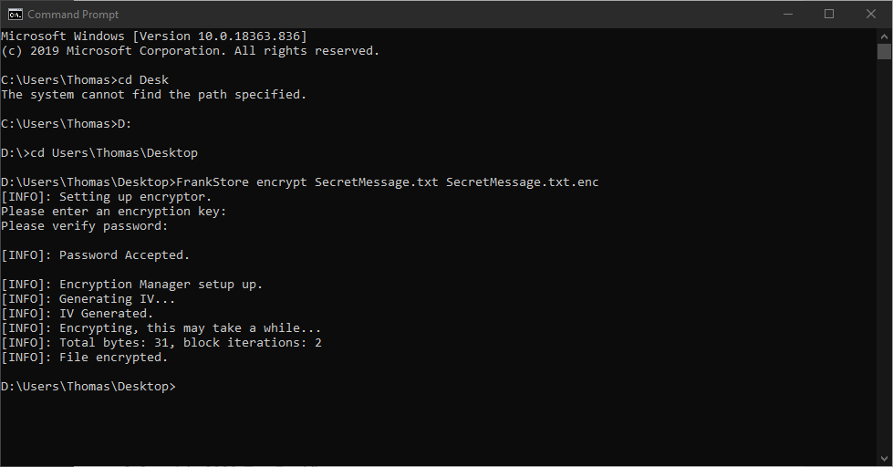
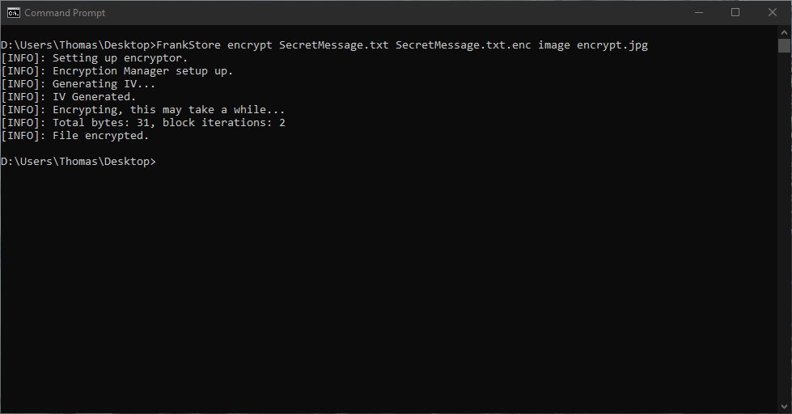
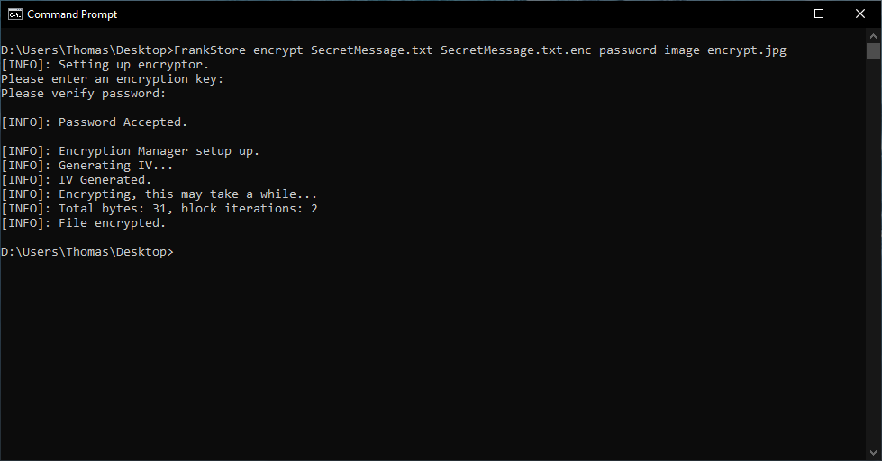
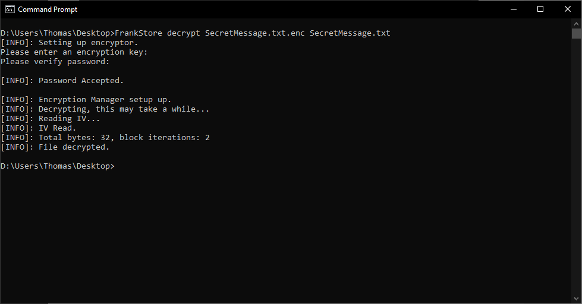
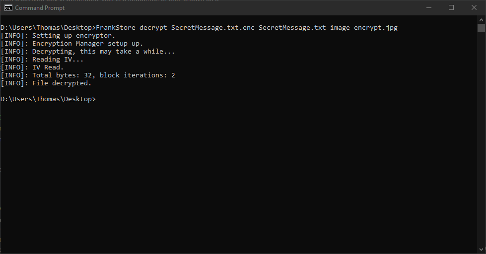
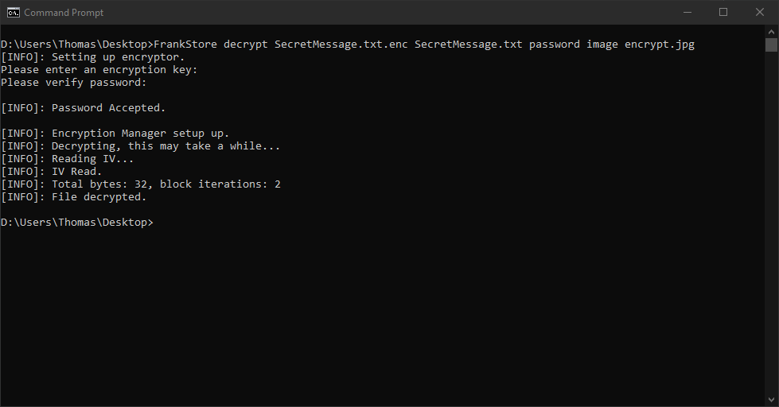
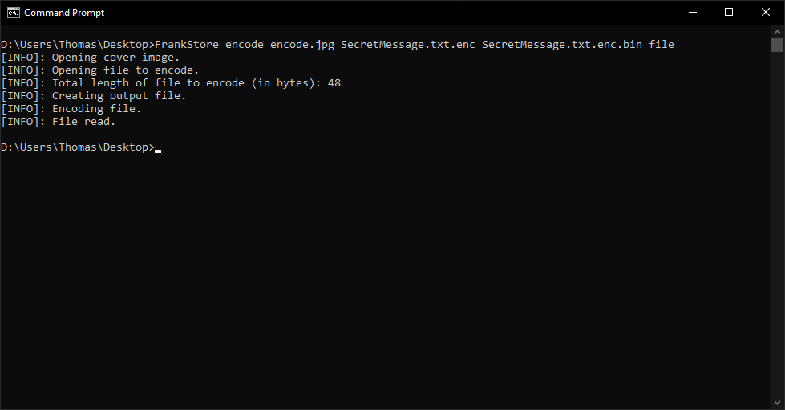
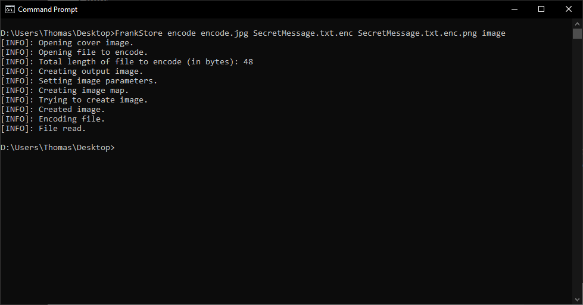
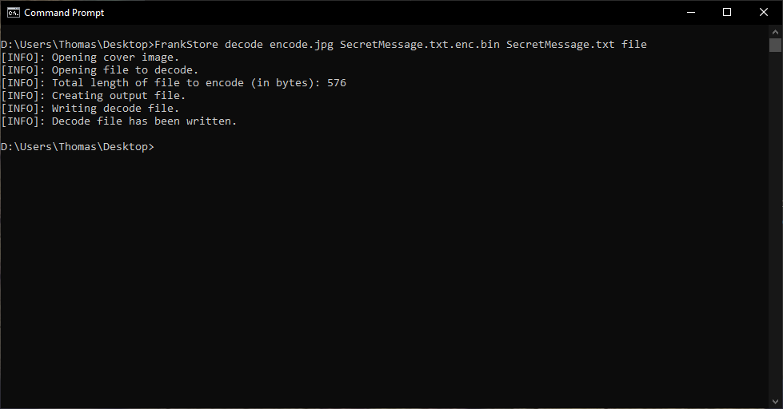
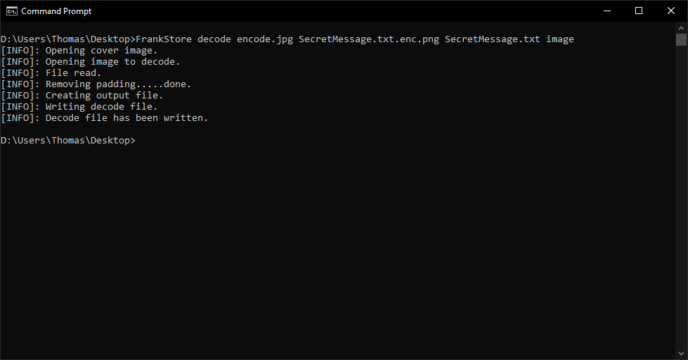

FrankStore - CLI
================

This section of the guide will be focusing on the CLI component of FrankStore. Both the CLI and GUI are two seperate programs, the CLI can run independently, however, the GUI requires the CLI to function.

Installing
----------

Currently, installation binaries are provided only for Windows (x64), we may soon look at deploying packages accross the major platforms. If you are on MacOS or Linux we kindly request you follow the `Compiling`_ instructions.

Windows
^^^^^^^

The lastest windows installation is available on `GitHub`_ here, please note the installation provides both the CLI and GUI including their retrospective requirements.

.. _github: https://github.com/thomasjcf29/FrankStore/releases

HOWEVER, you still need to install ImageMagick, the download is `available`_ here. You will require the installer with the following description: "Win64 dynamic at 16 bits-per-pixel component". At the time of writing the file name for that description is (``ImageMagick-7.0.10-11-Q16-x64-dll.exe``)

.. _available: https://imagemagick.org/script/download.php#windows

Close any open command prompts (to reset path variable) and run ``FrankStore`` into cmd.

Compiling
---------

Compiling instructions for FrankStore are below, for this guide we will be using Ubuntu (x64), Windows 10 (x64), and MacOS (x64).

Linux - Ubuntu
^^^^^^^^^^^^^^

Follow the sections below to compile FrankStore on Ubuntu.

Basic Compiler
""""""""""""""

1. ``sudo apt update && sudo apt upgrade``
2. ``sudo apt install build-essential cmake git pkg-config wget``

Exiv2 and OpenSSL
"""""""""""""""""

1. ``sudo apt update && sudo apt upgrade``
2. ``sudo apt install libexiv2-dev libssl-dev``

Compile ImageMagick
"""""""""""""""""""

1. ``wget https://imagemagick.org/download/ImageMagick.tar.gz``
2. ``tar -xvzf ImageMagick.tar.gz``
3. ``cd ImageMagick-(version)``
4. ``./configure``
5. ``make && make check``
6. ``sudo make install``
7. ``sudo ldconfig /usr/local/lib``
8. ``cd .. && rm -rf ImageMagick*``

Compile Libsodium
"""""""""""""""""

1. ``wget https://download.libsodium.org/libsodium/releases/LATEST.tar.gz``
2. ``tar -xvzf LATEST.tar.gz``
3. ``cd libsodium-stable``
4. ``./configure``
5. ``make && make check``
6. ``sudo make install``
7. ``cd .. && rm -rf libsodium-stable``
8. ``rm -f LATEST.tar.gz``

Compile FrankStore
""""""""""""""""""

1. ``git clone https://github.com/thomasjcf29/FrankStore.git``
2. ``cd FrankStore/Program``
3. ``cmake .``
4. ``cmake --build . --config Release``

Test FrankStore works with a simple ``./FrankStore``

MacOS
^^^^^

Follow the sections below to compile FrankStore on MacOS.

Basic Compiler
""""""""""""""

1. Open a terminal and type ``g++``, if a popup asks you to install, press yes.
2. Install CMake (x64) from CMakes website_.
3. After install, run this command to set cmake up for terminal ``sudo "/Applications/CMake.app/Contents/bin/cmake-gui" --install``

Homebrew
""""""""

Homebrew is a third-party package manager for MacOS, we will be using this to install the relevant dependencies.
Open a terminal and run these commands.

1. ``/bin/bash -c "$(curl -fsSL https://raw.githubusercontent.com/Homebrew/install/master/install.sh)"``
2. ``brew update``

Follow the one screen guidance.

Dependencies
""""""""""""

1. ``brew install pkg-config libsodium exiv2 openssl wget``
2. ``ln -s /usr/local/opt/openssl@1.1/lib/pkgconfig/* /usr/local/lib/pkgconfig/``

Compile ImageMagick
"""""""""""""""""""

1. ``wget https://imagemagick.org/download/ImageMagick.tar.gz``
2. ``tar -xvzf ImageMagick.tar.gz``
3. ``cd ImageMagick-(version)``
4. ``./configure``
5. ``make && make check``
6. ``sudo make install``
7. ``sudo ldconfig /usr/local/lib``
8. ``cd .. && rm -rf ImageMagick*``

Compile FrankStore
""""""""""""""""""

1. ``git clone https://github.com/thomasjcf29/FrankStore.git``
2. ``cd FrankStore/Program``
3. ``cmake .``
4. ``cmake --build . --config Release``

Test FrankStore works with a simple ``./FrankStore``

Windows
^^^^^^^

Follow the sections below to compile FrankStore on Windows.

Basic Compiler
""""""""""""""

1. Install Visual Studio 2019 Community from here_.
2. After installing Visual Studio Installer, select ``Desktop development with C++`` in the visual studio installer.
3. Install CMake (x64) from CMakes website_.
4. Install GIT tools from there_.

Close any command prompts or powershell windows you have open, to reset your path environment.

.. _here: https://visualstudio.microsoft.com/downloads/
.. _website: https://cmake.org/download/
.. _there: https://git-scm.com/downloads

VCPKG
"""""

VCPKG is a package manage for visual studio, it allows you to easily install the packages required for FrankStore to compile.

!!DO THIS IN A POWERSHELL WINDOW!!

1. ``git clone https://github.com/Microsoft/vcpkg.git``
2. ``cd vcpkg``
3. ``.\bootstrap-vcpkg.bat``
4. ``.\vcpkg integrate install``

LibSodium, Exiv2, OpenSSL
"""""""""""""""""""""""""

!!DO THIS IN A POWERSHELL WINDOW!!

1. ``cd vcpkg``
2. ``.\vcpkg install libsodium:x64-windows``
3. ``.\vcpkg install exiv2:x64-windows``
4. ``.\vcpkg install libressl:x64-windows``

ImageMagick
"""""""""""

Make sure to install the ImageMagick version with the description of ``Win64 dynamic at 16 bits-per-pixel component``.

1. Download ImageMagick_.
2. Install ImageMagick, make sure to tick the box for C/C++ Development Headers.

.. _ImageMagick: https://imagemagick.org/script/download.php#windows

Compile FrankStore
""""""""""""""""""

Close any command prompts or powershell windows you have open, to reset your path environment.

1. ``git clone https://github.com/thomasjcf29/FrankStore.git``
2. ``cd FrankStore\Program``
3. ``cmake .``
4. ``cmake --build . --config Release``

Test it works by runnning ``Release\FrankStore.exe``.

Encryption
----------

FrankStore provides built in encryption technologies using AES-256-CBC, you can encrypt files using a key either provided by you (like a password) and/or from EXIF data provided from an image. This information is then turned into a key using PBKDF2, a Key Deriviation Function. The IV (16 bytes) is secure random generated using the Libsodium library and written / read from the file during encryption / decryption. It is recommended to encrypt a file before encoding it for the extra security associated with it.

Encrypting Files
^^^^^^^^^^^^^^^^

Command Usage
"""""""""""""

There are multiple ways of encrypting a file within FrankStore all provide the same result (an encrypted file). Some are more secure than others due to the fact they take the password in a way the terminal *shouldn't* save.

Examples of valid commands are below.

Secure:

* ``FrankStore encrypt <fileToRead> <fileToOutput>``
* ``FrankStore encrypt <fileToRead> <fileToOutput> image <imageFile>``
* ``FrankStore encrypt <fileToRead> <fileToOutput> password image <imageFile>``

Insecure:

* ``FrankStore encrypt <fileToRead> <fileToOutput> password <password>``
* ``FrankStore encrypt <fileToRead> <fileToOutput> password <password> image <imageFile>``

Please note, that whilst we deem passing image locations in to be secure, we recommended you delete / move the image location so other people cannot access the original files location.

Figures
"""""""

CLI Command - Password:

CLI Command - Image:

CLI Command - Image and Password:

Decrypting Files
^^^^^^^^^^^^^^^^

Command Usage
"""""""""""""

There are multiple ways of decrypting a file within FrankStore all provide the same result (an decrypted file). Some are more secure than others due to the fact they take the password in a way the terminal *shouldn't* save.

Examples of valid commands are below.

Secure:

* ``FrankStore decrypt <fileToRead> <fileToOutput>``
* ``FrankStore decrypt <fileToRead> <fileToOutput> image <imageFile>``
* ``FrankStore decrypt <fileToRead> <fileToOutput> password image <imageFile>``

Insecure:

* ``FrankStore decrypt <fileToRead> <fileToOutput> password <password>``
* ``FrankStore decrypt <fileToRead> <fileToOutput> password <password> image <imageFile>``

Please note, that whilst we deem passing image locations in to be secure, we recommended you delete / move the image location so other people cannot access the original files location.

Figures
"""""""

CLI Command - Password:

CLI Command - Image:

CLI Command - Image and Password:

Steganography
-------------

FrankStore is designed to hide data in a way which means it is hard to prove that there is data even there. FrankStore does by using a cover image, it takes data from this CoverImage and uses it to hide the data into a new file or image depending on your chosen preferred outcome. They both output the same type of data (same algorithm) one just gives you a visual aesthetic to look at and takes a slight bit longer.

Encoding Files
^^^^^^^^^^^^^^

Command Usage
"""""""""""""

There are two ways of outputting an encoded file, either as an image or as a file, as explained above the algorithm is the same no matter the output type.

* ``FrankStore encode <coverImage> <fileToEncode> <outputFile> image``
* ``FrankStore encode <coverImage> <fileToEncode> <outputFile> file``

We recommend you to output as a .PNG file, we currently have not tested any other type of image.

Figures
"""""""

File Output:

Image Output:

Decoding Files
^^^^^^^^^^^^^^

Command Usage
"""""""""""""

There are two ways of inputting an encoded file, either as an image or as a file, as explained above the algorithm is the same no matter the input type.

* ``FrankStore decode <coverImage> <fileToEncode> <outputFile> image``
* ``FrankStore decode <coverImage> <fileToEncode> <outputFile> file``

We recommend you to input as a .PNG file, we currently have not tested any other type of image.

Figures
"""""""

File Output:

Image Output:

