FrankStore - GUI
================

This section of the guide will be focusing on the GUI component of FrankStore. Both the CLI and GUI are two seperate programs, the CLI can run independently, however, the GUI requires the CLI to function.

This program will run, however, will be useless without the CLI counterpart.

If your CLI component is not in a folder readily available to the UI when ran, for example, the current working directory or path variable, you will be asked for the CLI location each time you open it. We recommend moving the CLI tool into a path readily available for the GUI to search within.

The GUI will output multiple files in the directory of the source folder, the .bin / .png are always the files in there final encoded state. Currently the GUI will take the previous file extensions for example, .txt.png and convert it back by stripping the last extension off, so back to .txt. Therefore we request you keep the filename structure the same.

.output files are the CLI output recorded into a file, if there is an error encoding / decoding a file, this output may come in handy to troubleshoot the problem.

If you chose to encrypt / decrypt a file you will also have intermediary files which are .enc these are the source files in there encrypted form, you may choose to use them, but they are not encoded by FrankStore - just the encrypted format, you also have .output files containing the CLI output of the encryption / decryption task.

Installing
----------

Currently, installation binaries are provided only for Windows (x64), we may soon look at deploying packages accross the major platforms. If you are on MacOS or Linux we kindly request you follow the `Compiling`_ instructions.

Windows
^^^^^^^

The lastest windows installation is available on `GitHub`_ here, please note the installation provides both the CLI and GUI including their retrospective requirements.

.. _github: https://github.com/thomasjcf29/FrankStore/releases

HOWEVER, you still need to install ImageMagick, the download is `available`_ here. You will require the installer with the following description: "Win64 dynamic at 16 bits-per-pixel component". At the time of writing the file name for that description is (``ImageMagick-7.0.10-11-Q16-x64-dll.exe``)

.. _available: https://imagemagick.org/script/download.php#windows

Close any open command prompts (to reset path variable) and run ``FrankStore`` into cmd.

Compiling
---------

Compiling instructions for FrankStoreUI are below, for this guide we will be using Ubuntu (x64), Windows 10 (x64), and MacOS (x64).

Linux - Ubuntu
^^^^^^^^^^^^^^

Follow the sections below to compile FrankStoreUI on Ubuntu.

Basic Compiler
""""""""""""""

1. ``sudo apt update && sudo apt upgrade``
2. ``sudo apt install build-essential cmake git pkg-config wget``

GTKMM, GTK3 and LIBXML2
"""""""""""""""""""""""

1. ``sudo apt update && sudo apt upgrade``
2. ``sudo apt install libgtkmm-3.0-dev libxml2-utils``

Compile FrankStoreUI
""""""""""""""""""""

1. ``git clone https://github.com/thomasjcf29/FrankStore.git``
2. ``cd FrankStore/UI``
3. ``glib-compile-resources --target=resources.c --generate-source resource.xml``
4. ``cmake .``
5. ``cmake --build . --config Release``

Test FrankStoreUI works with a simple ``./FrankStoreUI`` when it asks for the FrankStore location point it towards the compiled FrankStore CLI tool.

MacOS
^^^^^

Follow the sections below to compile FrankStoreUI on MacOS.

Basic Compiler
""""""""""""""

1. Open a terminal and type ``g++``, if a popup asks you to install, press yes.
2. Install CMake (x64) from CMakes website_.
3. After install, run this command to set cmake up for terminal ``sudo "/Applications/CMake.app/Contents/bin/cmake-gui" --install``

Homebrew
""""""""

Homebrew is a third-party package manager for MacOS, we will be using this to install the relevant dependencies.
Open a terminal and run these commands.

1. ``/bin/bash -c "$(curl -fsSL https://raw.githubusercontent.com/Homebrew/install/master/install.sh)"``
2. ``brew update``

Follow the one screen guidance.

Dependencies
""""""""""""

1. ``brew install pkg-config gtkmm3``

Compile FrankStoreUI
""""""""""""""""""""

1. ``git clone https://github.com/thomasjcf29/FrankStore.git``
2. ``cd FrankStore/UI``
3. ``glib-compile-resources --target=resources.c --generate-source resource.xml``
4. ``cmake .``
5. ``cmake --build . --config Release``

Test FrankStoreUI works with a simple ``./FrankStoreUI`` when it asks for the FrankStore location point it towards the compiled FrankStore CLI tool.

Windows
^^^^^^^

Follow the sections below to compile FrankStoreUI on Windows.

Basic Compiler
""""""""""""""

MSYS2 with MinGW is required to compile FrankStoreUI on windows, this is due to the fact that GTK and GTKMM cannot be compiled using the Visual Studio compiler.

1. Download and install `MSYS2`_.
2. Add the ``msys64\mingw64\bin`` to your environment path variable.
3. Open ``MSYS2 MinGW 64-bit`` from your start menu.
4. Update your installation ``pacman -Syu``.
5. Update your package manager ``pacman -Su``.
6. Install compiler ``pacman -S mingw-w64-x86_64-gcc mingw-w64-x86_64-make``.
7. Install package manager ``pacman -S mingw-w64-x86_64-pkg-config``.
8. Install GIT tools from there_.
9. Install CMake (x64) from CMakes website_.

.. _msys2: https://www.msys2.org/
.. _website: https://cmake.org/download/
.. _there: https://git-scm.com/downloads

GTKMM and GTK3
""""""""""""""

Inside of your MSYS2 MinGW 64-bit terminal run these commands.

1. ``pacman -S mingw-w64-x86_64-gtkmm3``

Compile FrankStoreUI
""""""""""""""""""""

Complete these tasks in CMD or powershell.

1. ``git clone https://github.com/thomasjcf29/FrankStore.git``
2. ``cd FrankStore/UI``
3. ``glib-compile-resources --target=resources.c --generate-source resource.xml``
4. ``windres project.rc -O coff -o project.res``
5. ``cmake . -G "MinGW Makefiles"``
6. ``cmake --build . --config Release``

Test FrankStoreUI works with a simple ``FrankStoreUI.exe`` when it asks for the FrankStore location point it towards the compiled FrankStore CLI tool.

Encryption
----------

FrankStore provides built in encryption technologies using AES-256-CBC, you can encrypt files using a key either provided by you (like a password) and/or from EXIF data provided from an image. This information is then turned into a key using PBKDF2, a Key Deriviation Function. The IV (16 bytes) is secure random generated using the Libsodium library and written / read from the file during encryption / decryption. It is recommended to encrypt a file before encoding it for the extra security associated with it.

Unlike the CLI component if you choose to use encryption the GUI will automatically encrypt and then encode or decode and then decrypt a file. This process cannot currently be seperated, if you would like to do only encryption/decryption then please use the CLI tool directly, following the CLI guide.

After setting up your encryption/decryption parameters please go to the Steganography section before clicking encode.

Encrypting/Decrypting Files
^^^^^^^^^^^^^^^^^^^^^^^^^^^

GUI Usage
"""""""""

There are three ways of encrypting a file within FrankStoreUI:

* Password only
* Image only
* Password and Image

Like CLI, the exif data is read from the image and turned into a key, if with a password they are combined together.

The password, exif data, or password and exif data, is passed into a PBKDF2 function and converted into a key to be used by an encryption system.

1. You must tick the "Yes, encrypt my files." box.
2. Click Add Image Key if you want to read from EXIF data.
3. -OR- Click Add Password if you want to input a password.
4. -OR- Click Add Password and add Image Key if you want to input a key and read from EXIF data.

Please note password usage will pass the password directly into the cli using the <password> parameter, please ensure your operating system does not log this.

The edit and remove buttons are self explanatory.

Due to the fact that encryption / decryption is done with the encode / decode process both have been placed under the same section. Follow the Steganography section and then click encode (for encryption) or decode (for decryption).

Figures
"""""""

Enabling Encryption/Decryption:

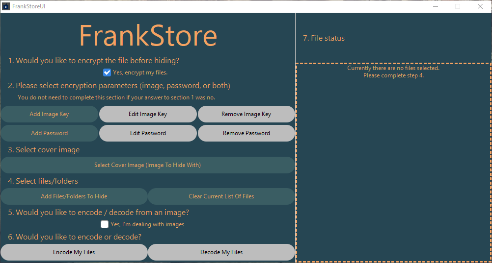

Add Image Key:

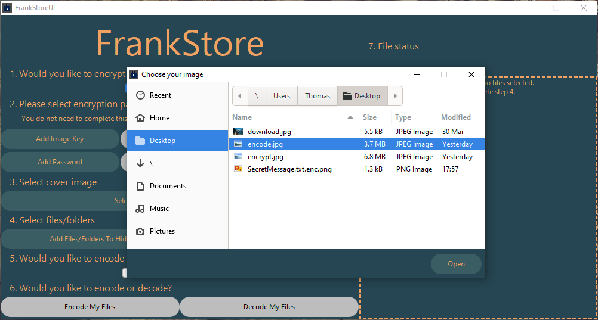

Add Password:

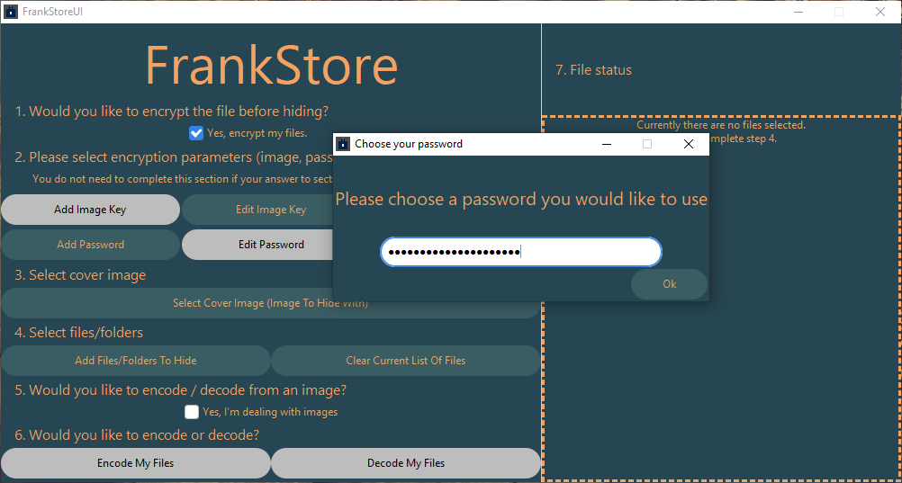

Steganography
-------------

FrankStore is designed to hide data in a way which means it is hard to prove that there is data even there. FrankStore does by using a cover image, it takes data from this CoverImage and uses it to hide the data into a new file or image depending on your chosen preferred outcome. They both output the same type of data (same algorithm) one just gives you a visual aesthetic to look at and takes a slight bit longer.

Selecting Cover Image
^^^^^^^^^^^^^^^^^^^^^

GUI Usage
"""""""""

The cover image is required as it is used during the encoding / decoding process to hide the input file.

Choose the "Select Cover Image" button and choose the image you would like to use to hide the data with. Please note the output file is not the image itself, rather the image is used as a form of key to hide the data.

We recommend you use a different image to the encrypt image if you choose to encrypt using an image.

Figures
"""""""

Selecting Cover Image:

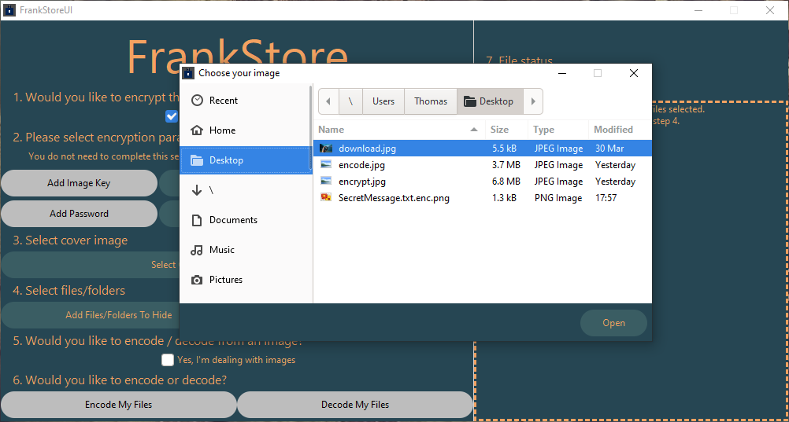

Adding Files To Hide
^^^^^^^^^^^^^^^^^^^^

GUI Usage
"""""""""

You are able to choose either a file or folder that you would like to add. If you choose a folder you will be prompted to ensure you meant to choose that folder, if you click yes the program will add all files within that folder and any child folder no matter how deep it is.

You can add files/folders using the "Add Files/Folders To Hide" button.

You can clear the list of files to hide using the "Clear Current List Of Files" button.

Figures
"""""""

Adding One File:

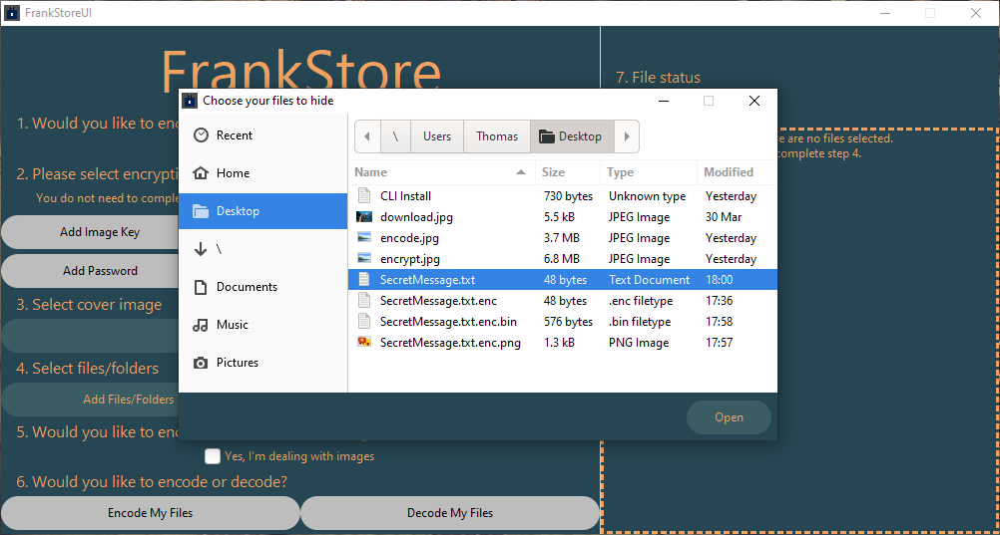

Adding A Folder:

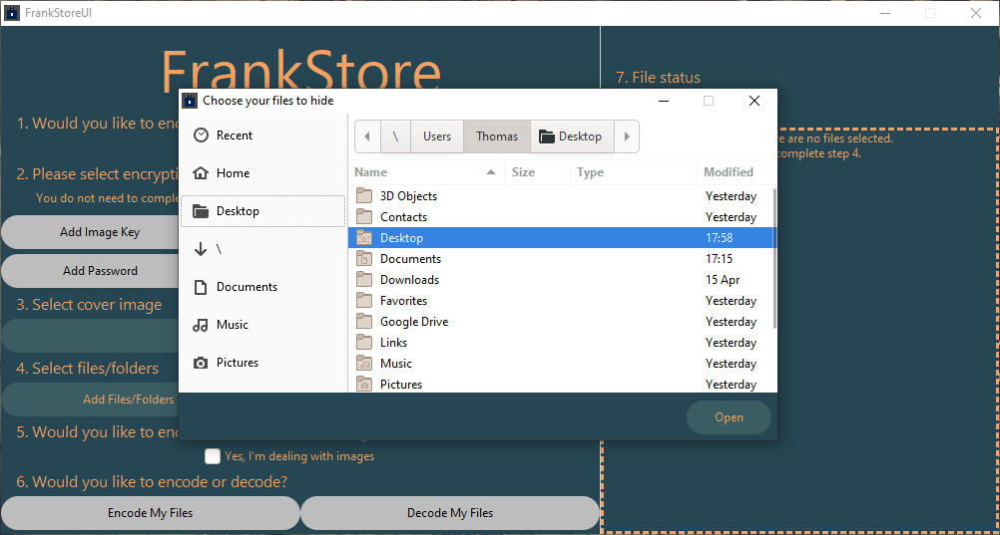

Folder Prompt:

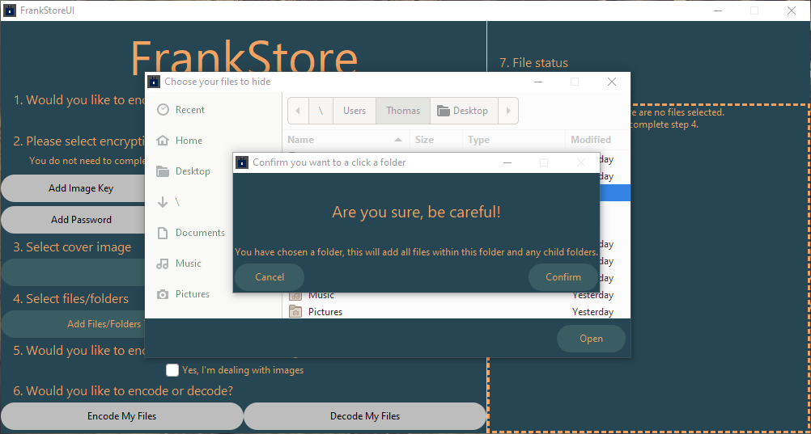

Files Displayed:

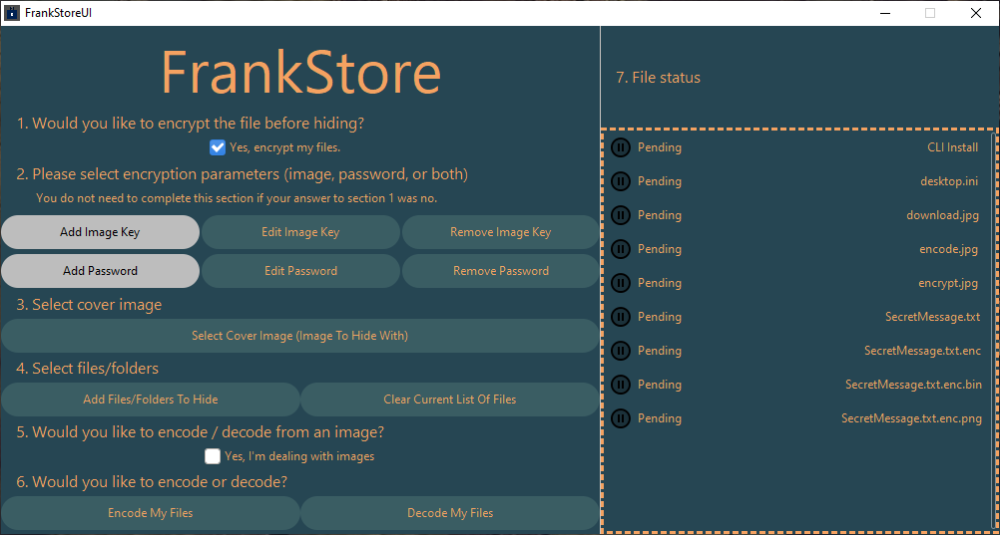

In/Outputting Images
^^^^^^^^^^^^^^^^^^^^

GUI Usage
"""""""""

If you would like to read/output from/to an image, then please check the box to say the output/input file is an image. This will then pass the correct parameters to CLI tool.

Figures
"""""""

Input/Output Is An Image:

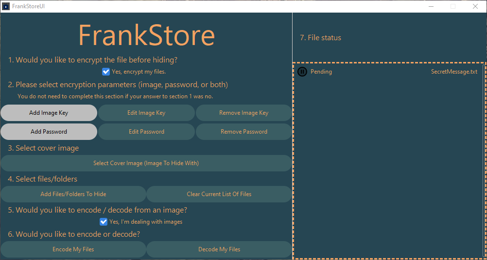

Input/Output Is NOT An Image:

Encoding/Decoding Files
^^^^^^^^^^^^^^^^^^^^^^^

GUI Usage
"""""""""

Finally once all of the above steps have been completed although `Encryption`_ is optional, click "Encode My Files" or "Decode My Files" to begin the process. Encode/Decode will also Encrypt/Decrypt if Section 1 and Section 2 of the GUI have been completed.

Please note when encoding, encryption if enabled will be done first then the encrypted output will be encoded.

If decoding and decryption is enabled, the file will be decoded first and then the decoded output will be decrypted.

Figures
"""""""

GUI Output Encoded:

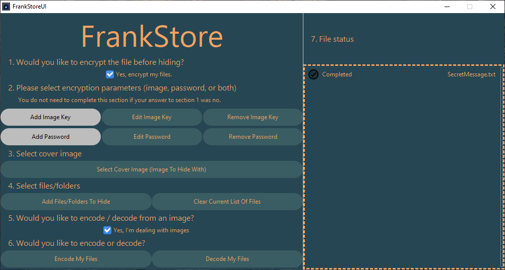

GUI Output Decoded:

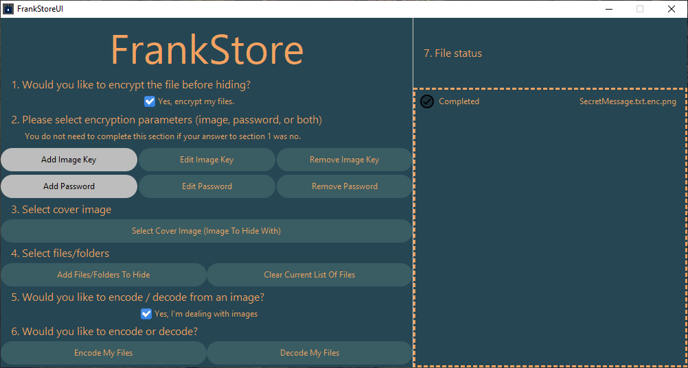

GUI In Progress Screen:

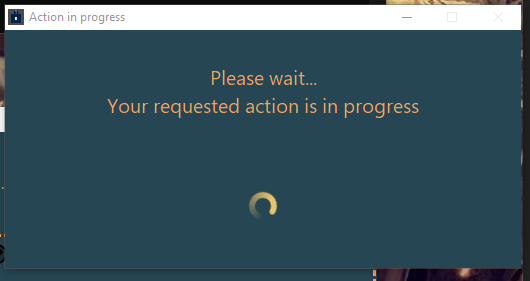
