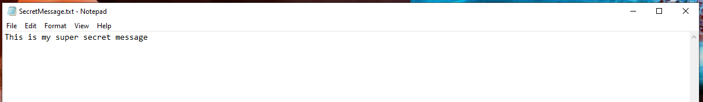

FrankStore
==========

FrankStore provides a simple way to hide information using images with optional encryption (AES-256-CBC). FrankStore has both an GUI and CLI.
Please see the `Examples`_ section for an image of the CLI, GUI, Secret Message, and the hidden result.

Requirements
------------

* `GTK`_ 3.24.20
* `GTKMM`_ 3.24
* `Exiv2`_ 0.27.2
* `Libsodium`_ 1.0.18
* `OpenSSL`_ 1.1.1
* `ImageMagick`_ 7.0.10-11

.. _GTK: https://gtk.org/
.. _GTKMM: https://gtkmm.org/
.. _Exiv2: https://www.exiv2.org/
.. _Libsodium: https://doc.libsodium.org/
.. _OpenSSL: https://www.openssl.org/
.. _ImageMagick: https://imagemagick.org/

These are the specific versions FrankStore is built against.  Use other versions at your own risk.

Examples
--------

Table of Contents
-----------------

.. toctree::
   CLI
   GUI
